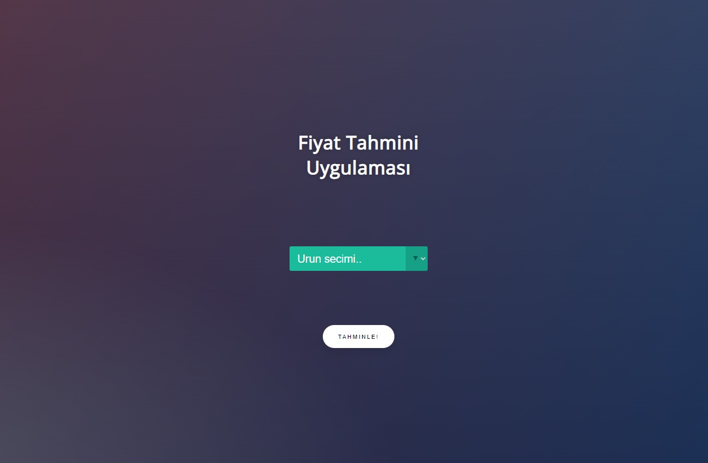

## ML Model Visualization Flask Deployment
This is a demo project to elaborate how Machine Learn Models are deployed on production using Flask API

### Prerequisites
You must have Scikit Learn, Plotly, Pandas (for Machine Leraning Model) and Flask (for API) installed.

### Project Structure
This project has two major parts :
app.py - This contains Flask APIs that receives employee details through GUI or API calls, computes the precited value based on our model and returns it.
templates - This folder contains the HTML template to allow user to enter employee detail and displays the predicted employee salary.

### Running the project

python app.py

By default, flask will run on port 5000.

Navigate to URL http://localhost:5000
